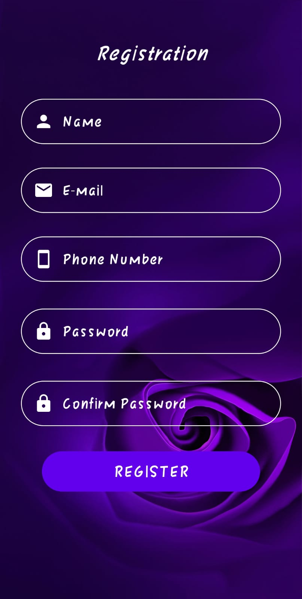
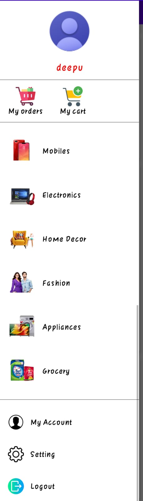
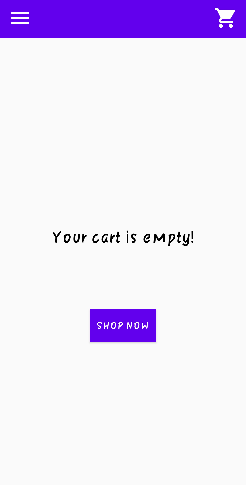
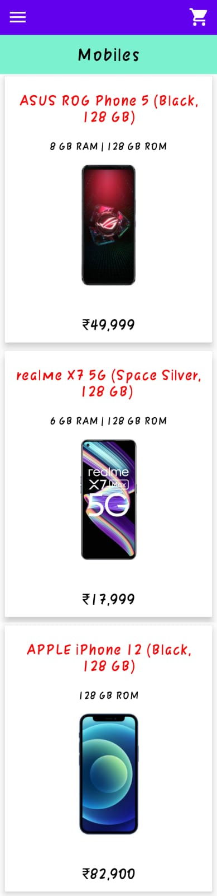
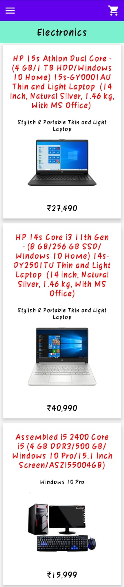
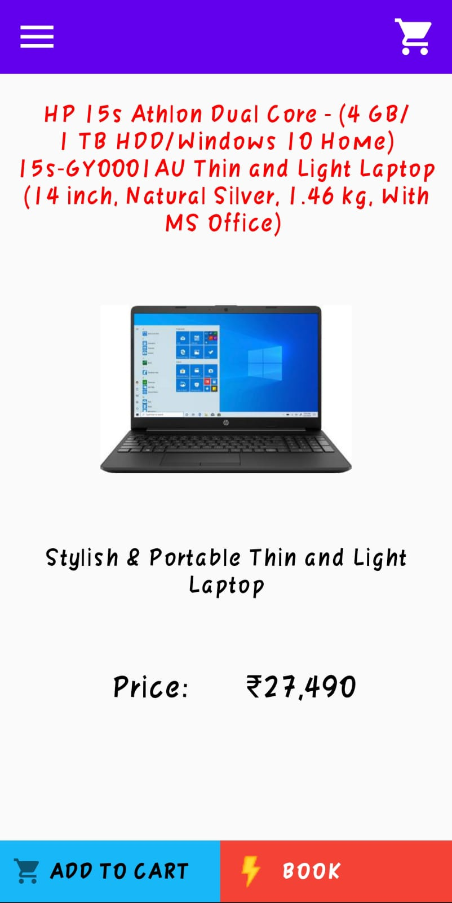
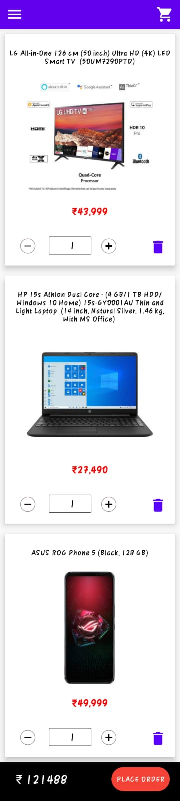
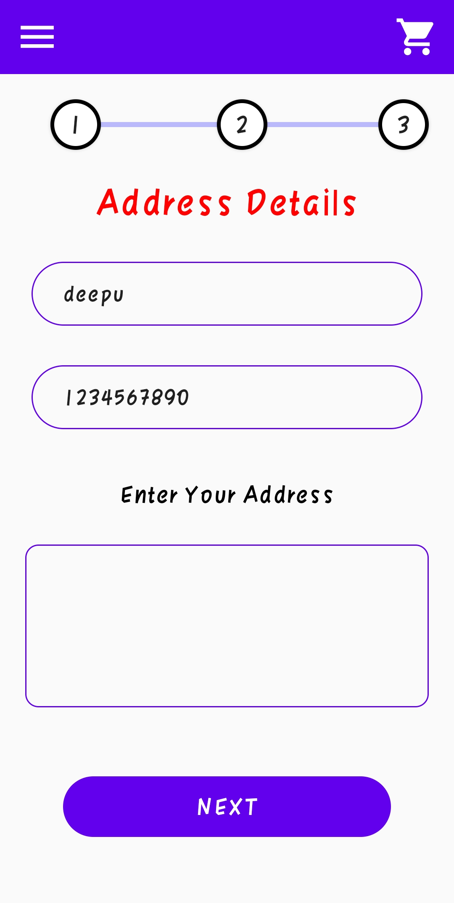
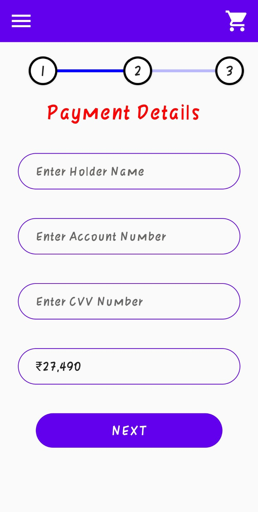
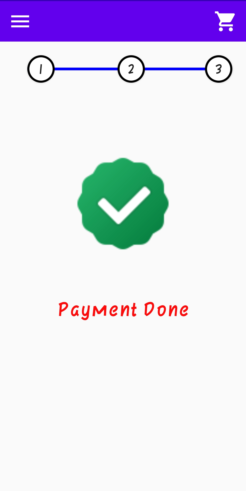

# MegaKart Android App

* This project is run only Android Platform.
* This project uses Java Language for backend and Firebase for Database.
* This app run only Android 7 version and above.

* IDE :- Android Studio
* OS  :- Windows

<h3>Login Page</h3>
</img>
<h3>Register Page</h3>
</img>
<h3>Home Page</h3>
</img>
<h3>Navdrawer</h3>
</img>
<h3>Cart Page (Empty) </h3>
</img>
<h3>Mobile Page</h3>
</img>
<h3>Electronic Page</h3>
</img>
<h3>Detail Page</h3>
</img>
<h3>Cart Page (Empty) </h3>
</img>
<h3>Address Page</h3>
</img>
<h3>Payment Page</h3>
</img>
<h3>Success Page</h3>
</img>
